# Phase 3 Discovery: Practice Content Sources

**Discovery Date:** 2026-01-07
**Discovery Level:** 0 (Internal audit - no external research needed)

## Executive Summary

Practice content is **completely separate** from curriculum progression. Users can be quizzed on vocabulary they've never seen in lessons. The database schema supports lesson-linked content (`VocabularyItem`, `Exercise` with `lessonId`), but these tables are empty.

---

## 1. Practice Vocabulary System

**Source:** `PracticeVocabulary` table (NOT tied to curriculum)

**API Endpoint:** `GET /api/practice/prompts`
- Returns ALL active vocabulary from `PracticeVocabulary` table
- Falls back to static JSON (`data/practice-vocabulary.json`) if DB fails
- **NO filtering by user progress or completed lessons**

**Schema:**
```prisma
model PracticeVocabulary {
  id         String  @id @default(cuid())
  macedonian String
  english    String
  category   String?
  difficulty String  @default("beginner")
  isActive   Boolean @default(true)
  // NO lessonId field - not tied to curriculum
}
```

**Key Finding:** Practice vocabulary is a standalone dataset, separate from UKIM curriculum content.

---

## 2. Practice Decks (usePracticeDecks.ts)

The `usePracticeDecks` hook provides multiple deck sources:

| Deck Type | Source | Lesson-Linked? |
|-----------|--------|----------------|
| **Curated** | `PracticeVocabulary` table | No |
| **Mistakes** | localStorage wrong answers | No |
| **SRS** | Spaced repetition due cards | No |
| **Favorites** | User-saved items | No |
| **Custom** | User-created decks | No |
| **Topic Decks** | Predefined topic packs | No |

**Key Finding:** None of the current deck types filter by completed lessons.

---

## 3. Grammar Practice

**Source:** Static JSON file (`data/grammar-lessons.json`)

**Characteristics:**
- Standalone grammar lessons (Definite Article, Verb Conjugation, etc.)
- Progress stored in **localStorage** (not database)
- NO connection to UKIM curriculum lessons
- NO source lesson references ("taught in Lesson X")

**Example grammar lesson structure:**
```json
{
  "id": "definite-article-basics",
  "titleMk": "Определен член - Основи",
  "titleEn": "The Definite Article - Basics",
  "difficulty": "beginner",
  "exercises": [...]
  // NO lessonId or curriculum reference
}
```

**Key Finding:** Grammar drills exist independently from curriculum. Users don't know which UKIM lesson teaches each concept.

---

## 4. Curriculum-Linked Models (Exist but Empty)

The Prisma schema has models designed for lesson-linked content:

### VocabularyItem
```prisma
model VocabularyItem {
  id             String  @id @default(cuid())
  lessonId       String  // Links to CurriculumLesson
  macedonianText String
  englishText    String
  // ... other fields
  lesson         CurriculumLesson @relation(...)
}
```
**Current records:** 0

### Exercise
```prisma
model Exercise {
  id            String  @id @default(cuid())
  lessonId      String  // Links to CurriculumLesson
  type          String
  question      String
  correctAnswer String
  // ... other fields
  lesson        CurriculumLesson @relation(...)
}
```
**Current records:** 0

**Key Finding:** Schema supports lesson-linked content, but vocabulary/exercises weren't seeded from curriculum parsing.

---

## Data Flow Diagram

```mermaid
graph TB
    subgraph "Current Practice Flow"
        A[User starts practice] --> B[usePracticeDecks hook]
        B --> C[GET /api/practice/prompts]
        C --> D[(PracticeVocabulary table)]
        D --> E[Returns ALL active vocab]
        E --> F[Quiz any word - regardless of progress]
    end

    subgraph "Grammar Flow"
        G[User opens grammar] --> H[grammar-lessons.json]
        H --> I[Standalone exercises]
        I --> J[No curriculum context]
    end

    subgraph "Unused Infrastructure"
        K[(VocabularyItem - 0 records)]
        L[(Exercise - 0 records)]
        M[UserLessonProgress]
        K -.->|"Would filter by"| M
        L -.->|"Would filter by"| M
    end

    style D fill:#f96,stroke:#333
    style H fill:#f96,stroke:#333
    style K fill:#9f9,stroke:#333
    style L fill:#9f9,stroke:#333
```



---

## Gap Analysis

### The Problem

| Aspect | Current State | Desired State |
|--------|---------------|---------------|
| Practice vocab source | `PracticeVocabulary` (generic, ~200 items) | `VocabularyItem` from completed lessons |
| Grammar drill context | Standalone, no references | Shows "Taught in: Lesson X" |
| Exercise source | None (0 records) | `Exercise` from completed lessons |
| Content filtering | None - quiz anything | Only quiz completed content |

### Root Cause

**Phase 1 (Curriculum Backbone)** focused on:
- PDF parsing infrastructure
- Module/Lesson structure
- Journey ordering

**What wasn't done:**
- Vocabulary extraction from PDF text
- Seeding `VocabularyItem` records
- Creating `Exercise` content per lesson

The curriculum JSON files have `vocabularyItems: []` arrays - vocabulary wasn't extracted from the textbook PDFs.

---

## Recommended Approach for Phase 3

Given the empty `VocabularyItem` and `Exercise` tables, Phase 3 focuses on **infrastructure**:

### Plan 03-01 (This Plan)
- Document practice sources and gap (COMPLETE)

### Plan 03-02: Completed-Lesson Content API
- Create `GET /api/practice/lesson-vocab` endpoint
- Add `lesson-review` deck type to practice decks
- **Note:** Will return empty until vocab is seeded

### Plan 03-03: Grammar Drill Lesson References
- Map grammar lessons to UKIM curriculum concepts
- Add "Taught in: Lesson X" badges to grammar UI
- **This works now** - doesn't need vocab seeding

---

## Dependencies for Full Implementation

To achieve "practice only quizzes completed content":

1. **VocabularyItem seeding** - Extract vocab from curriculum JSON or PDF
2. **Exercise creation** - Create exercises per lesson
3. **Practice filtering** - Use infrastructure from 03-02

This is outside Phase 3 scope. Phase 3 builds the infrastructure; vocabulary seeding is future work (possibly Phase 4 or a supplementary task).

---

*Discovery completed: 2026-01-07*
