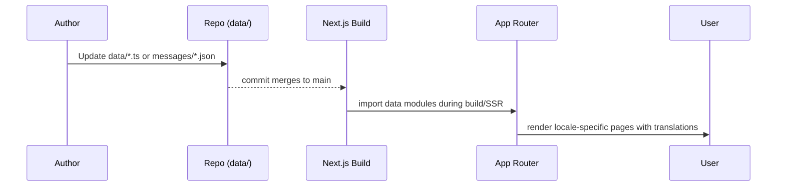

# Content Pipeline

> **Last Updated**: 2025-10-27  > **Owner**: Vincent Battaglia  > **Review Cycle**: Monthly

This document explains how localized learning content flows from static data sources and Prisma into the learner experience.

## Content Sources

- **Static Modules (`data/`)**
  - `journeys.ts`: Defines the canonical list of learning journeys, their slug, level, and descriptive metadata.
  - `journey-practice-content.ts`: Maps journey ids to practice prompts, vocabulary, and drills consumed by widgets.
  - `practice.ts` & `practice-vocabulary.json`: Provide structured sets of exercises for the Learn > Practice modules.
  - `resources.json`: Curated resource list for the Resources route.
- **Localization Bundles (`messages/*.json`)**
  - `en.json` and `mk.json` mirror keys for all learner-facing strings.
- **Database (Prisma)**
  - Dynamic entities like task boards live in the database and are accessed via `lib/prisma.ts`.

## Flow Diagram

## Authoring Workflow

1. Update the relevant module in `data/` or JSON in `messages/`.
2. Run local type checks (`pnpm lint`, `pnpm test`) to ensure schemas remain valid.
3. For localization changes, coordinate with the glossary owner and update `docs/localization/glossary.md` when new terminology is introduced.
4. Submit a PR that pairs code with documentation updates (feature guides, localization notes).

## Validation Checklist

- [ ] TypeScript types in `data/` compile without `any` escapes.
- [ ] `messages/en.json` and `messages/mk.json` share identical key sets.
- [ ] Feature-specific docs reference any new content (e.g., new journey slug).
- [ ] If Prisma schema changed, run `pnpm prisma migrate dev` and describe the migration in this doc.

## Future Enhancements

- Document automated tests that ensure data and translations stay in sync.
- Add guidance for machine-assisted translation reviews.
- Capture content versioning policy and rollback steps.
