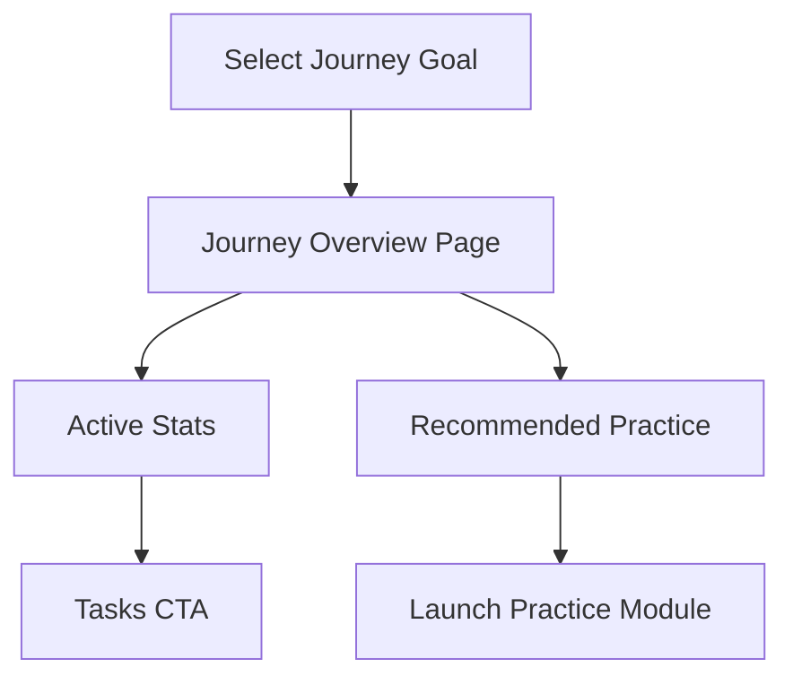

# Journeys Experience

> **Last Updated**: 2025-10-27  > **Owner**: Vincent Battaglia  > **Review Cycle**: Monthly

The Journeys feature personalizes study plans around learner goals. Locale-aware pages live under `app/[locale]/journey/[goal]/` with supporting components in `components/journey/` and hooks in `hooks/`.

## User Flow

1. Learner selects a goal from the `Journeys` landing page (`app/[locale]/journey/[goal]/page.tsx`).
2. Page renders localized copy via `TranslationProvider` and journey definitions from `data/journeys.ts`.
3. Stats components (`ActiveJourneyStat`, `JourneyStepsStat`, `JourneyLastSessionStat`) surface progress using hooks under `hooks/`.
4. Recommended practice content is drawn from `data/journey-practice-content.ts` and ties into Learn modules.

## Key Components & Hooks

| Entity | Location | Purpose |
| --- | --- | --- |
| `ActiveJourneyStat` | `components/journey/ActiveJourneyStat.tsx` | Displays current journey streak/step count. |
| `JourneyStepsStat` | `components/journey/JourneyStepsStat.tsx` | Weekly steps visualization. |
| `JourneyLastSessionStat` | `components/journey/JourneyLastSessionStat.tsx` | Highlights last practice session timestamp. |
| `useActiveJourney` | `hooks/use-active-journey.ts` | Resolves the learner’s active journey selection. |
| `useJourneyProgress` | `hooks/use-journey-progress.ts` | Aggregates session metrics for dashboards. |

## Content Dependencies

- Journey definitions: `data/journeys.ts`
- Practice content mapping: `data/journey-practice-content.ts`
- Localization keys: `messages/*` paths prefixed with `journey.` and `stats.`

## Testing

- Components use React Testing Library + Vitest (see `components/learn/QuickPracticeWidget.test.tsx` as a reference for stat widgets).
- Add snapshot or DOM assertions when introducing new journey tiles or stat types.

## Open Items

- Document how journey completion impacts tutor prompts once persistence is live.
- Add analytics events section (pending instrumentation).
