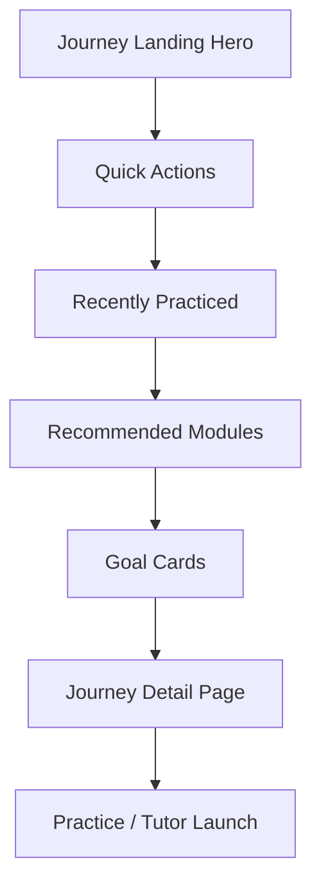

# Journeys Experience

> **Last Updated**: 2025-11-03  > **Owner**: Vincent Battaglia  > **Review Cycle**: Monthly

The Journeys feature personalizes study plans around learner goals. Locale-aware pages live under `app/[locale]/journey/[goal]/` with supporting components in `components/journey/` and hooks in `hooks/`.

## User Flow

1. Landing page (`app/[locale]/page.tsx`) highlights the active streak and campaign goals with a gradient hero and embedded stats.
2. Quick actions (`QUICK_ACTIONS` constant) surface the workspaces used most often, including inline progress bars.
3. Recently practiced and recommended grids keep warm-up drills and curated modules one click away.
4. Journey cards stay at the end of the scroll to drive deeper goal exploration at the moment of intent.

## Key Components & Hooks

| Entity | Location | Purpose |
| --- | --- | --- |
| `JourneyHomePage` | `app/[locale]/page.tsx` | Orchestrates hero, quick actions, recently practiced, recommended modules, and goal cards. |
| `ActiveJourneyStat` | `components/journey/ActiveJourneyStat.tsx` | Renders active journey label inside the hero stats cluster. |
| `JourneyStepsStat` | `components/journey/JourneyStepsStat.tsx` | Supplies weekly step counts for the hero dashboard. |
| `JourneyLastSessionStat` | `components/journey/JourneyLastSessionStat.tsx` | Announces when the learner last completed a session. |
| `HeroProgressSummary` | `components/journey/HeroProgressSummary.tsx` | Presents streak, goal minutes, and session progress using hydrated daily/weekly minute totals. |
| `QuickPracticeWidget` | `components/learn/QuickPracticeWidget.tsx` | Sticky companion widget anchoring the right rail. |
| `useActiveJourney` | `hooks/use-active-journey.ts` | Resolves the learner’s active journey selection. |
| `useJourneyProgress` | `hooks/use-journey-progress.ts` | Aggregates streaks plus daily/weekly minute totals from LocalStorage-backed session history. |

## Landing Page Layout

| Section | Description | Key Data/Translations |
| --- | --- | --- |
| Hero progress panel | Gradient surface with streak, minute goal, session bar, and stat cards; primary CTA launches practice lab. | `HeroProgressSummary`, `journey.progress.*`, `useJourneyProgress` streak/session + minute aggregates, `JourneyGoalMeta` minutes. |
| Quick actions | Grid of four workspace shortcuts with progress bars and warm-up time copy. | `QUICK_ACTIONS` constant, `journey.quickActions` translations. |
| Recently practiced | Cards summarising the last drills a learner touched with streak and minute metadata. | `RECENTLY_PRACTICED` constant, `journey.recent` translations. |
| Recommended modules | Curated modules that rotate by theme (listening, culture, travel). | `RECOMMENDED` constant, `journey.recommended` translations. |
| Goal cards | Journey previews anchored to detailed routes. | `JOURNEY_IDS`, `JOURNEY_DEFINITIONS`, `journey.goals` translations. |

## Content Dependencies

- Journey definitions: `data/journeys.ts`
- Practice content mapping: `data/journey-practice-content.ts`
- Localization keys: `messages/*` paths prefixed with `journey.` (expanded with `progress.goalLabel`, `quickActions.progressLabel`, `recent.*`, `recommended.*`).
- Quick action/recent/recommended constants: defined inside `app/[locale]/page.tsx` for now; move to shared data module if reused elsewhere.
- Session logging: `useJourneyProgress.logSession({ durationMinutes })` invoked by practice hub and translator pages to keep daily/weekly minute totals current.

## Testing

- Components continue to use React Testing Library + Vitest (see `components/learn/QuickPracticeWidget.test.tsx` for modal behaviour).
- When adjusting landing sections, cover rendering smoke tests for translated copy and ensure quick action buttons keep correct hrefs per locale.
- Validate that streak and goal copy render pluralisation correctly with `next-intl` ICU formatting.
- Add unit coverage when changing `useJourneyProgress` aggregation logic so daily/weekly minute totals stay accurate after LocalStorage migrations.

## Open Items

- Document how journey completion impacts tutor prompts once persistence is live.
- Add analytics events section (pending instrumentation).
