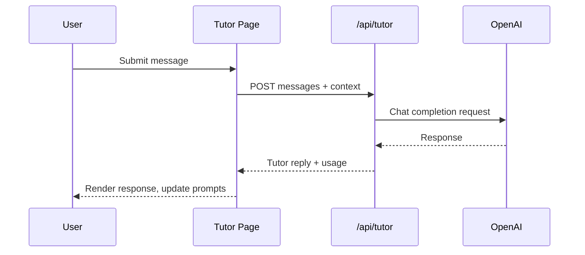

# Tutor Experience

> **Last Updated**: 2025-10-27  > **Owner**: Vincent Battaglia  > **Review Cycle**: Monthly

The Tutor experience provides conversational practice tailored to a learner’s active journey. The UI lives at `app/[locale]/tutor/page.tsx` and integrates with `/api/tutor` for responses.

## Flow Overview

## UI Components

- **Header Card**: Introduces the feature and surfaces flags while chat is in beta.
- **Conversation Log**: Renders alternating user and tutor messages, with planned streaming support.
- **Starter Prompt Tray**: Offers quick entry points using journey practice data.
- **Session Summary** (planned): Displays insights when a session ends.

## Context Providers

- `useActiveJourney()` and `useJourneyProgress()` supply the context object forwarded to the API.
- Journey prompts generated via `data/journey-practice-content.ts` and `buildJourneyTutorPrompt` keep responses grounded.

## API Contract Highlights

- See [`docs/api/tutor.md`](../api/tutor.md) for request/response schemas.
- Mock responses allow the UI to render when `OPENAI_API_KEY` is absent.

## Open Items

- Persist chat history using the Prisma models described in the [Tutor Roadmap](../roadmap/tutor-roadmap.md).
- Instrument analytics events for session start, message send, and prompt selection.
- Document feature flag strategy (`NEXT_PUBLIC_ENABLE_TUTOR_CHAT`).
