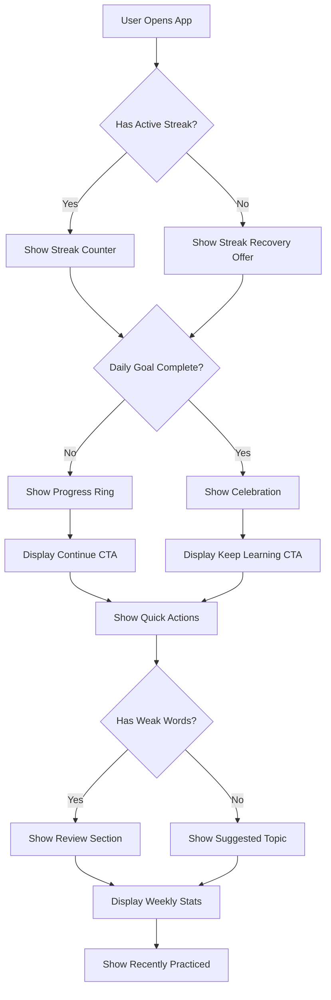
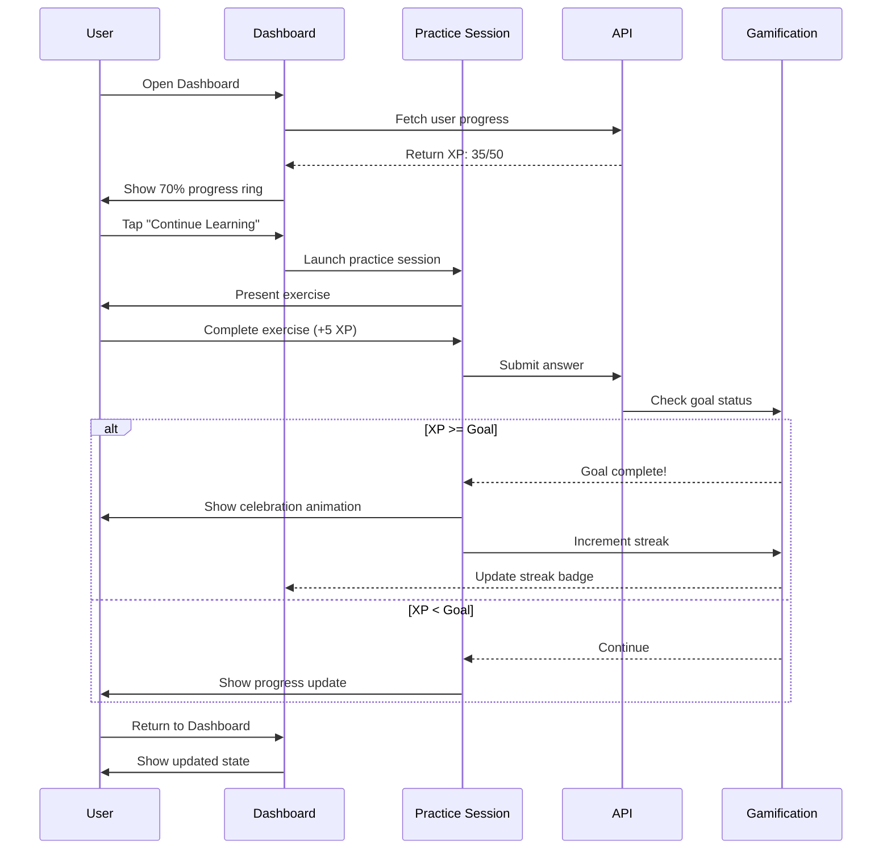

# Task 4: Dashboard Engagement Flow

> **Last Updated:** 2025-12-14  
> **Owner:** Product Team  
> **Review Cycle:** Quarterly

---

## 1. Dashboard Information Architecture

### 1.1 Component Hierarchy

```
Dashboard Page
├── Header Section
│   ├── Greeting (time-aware)
│   ├── Streak Counter
│   └── XP Badge
│
├── Primary CTA Block (Daily Goal)
│   ├── Progress Ring
│   ├── Goal Status Text
│   └── Continue Button
│
├── Quick Actions Grid (2x3 or 3x2)
│   ├── Practice
│   ├── Translate
│   ├── Reader
│   ├── News
│   └── Resources
│
├── Recommended Next Action
│   ├── Lesson Card
│   ├── Review Card
│   └── Challenge Card
│
├── Progress Summary
│   ├── Weekly Stats
│   ├── Level Progress
│   └── Accuracy Trend
│
├── Words Needing Review
│   ├── Weak Words List (3-5 items)
│   └── Review Now CTA
│
└── Recently Practiced
    ├── Topic Pills
    └── Quick Resume Links
```

### 1.2 Priority Order (Mobile)

1. **Daily Goal Progress** - Always visible above fold
2. **Continue CTA** - One-tap resume
3. **Quick Actions** - Fast navigation
4. **Weak Words** - Spaced repetition nudge
5. **Stats** - Motivational reinforcement

---

## 2. Wireframes

### 2.1 Mobile Dashboard (375px)

```
┌─────────────────────────────────────┐
│ Good morning, Viktor!     🔥 12     │
│ Ready for today's lesson?   845 XP  │
├─────────────────────────────────────┤
│                                     │
│        ╭─────────────────╮          │
│        │    ┌─────┐      │          │
│        │    │ 35  │      │          │
│        │    │ /50 │      │          │
│        │    │ XP  │      │          │
│        │    └─────┘      │          │
│        │  70% complete   │          │
│        ╰─────────────────╯          │
│                                     │
│  ┌─────────────────────────────┐    │
│  │     Continue Learning       │    │
│  │     15 XP to daily goal     │    │
│  └─────────────────────────────┘    │
│                                     │
├─────────────────────────────────────┤
│ QUICK ACTIONS                       │
│ ┌─────────┐ ┌─────────┐ ┌─────────┐ │
│ │ 📚      │ │ 🌐      │ │ 📖      │ │
│ │Practice │ │Translate│ │ Reader  │ │
│ └─────────┘ └─────────┘ └─────────┘ │
│ ┌─────────┐ ┌─────────┐             │
│ │ 📰      │ │ 📋      │             │
│ │  News   │ │Resources│             │
│ └─────────┘ └─────────┘             │
├─────────────────────────────────────┤
│ WORDS TO REVIEW                     │
│ ┌─────────────────────────────────┐ │
│ │ здраво   →   hello        ⚠️   │ │
│ │ благодарам → thank you    ⚠️   │ │
│ │ молам    →   please       ⚠️   │ │
│ │                                 │ │
│ │      [Review Now →]             │ │
│ └─────────────────────────────────┘ │
├─────────────────────────────────────┤
│ THIS WEEK                           │
│ ┌───────┬───────┬───────┬───────┐   │
│ │ 12    │ 145   │ 87%   │ 5     │   │
│ │lessons│  XP   │ acc.  │topics │   │
│ └───────┴───────┴───────┴───────┘   │
└─────────────────────────────────────┘
```

### 2.2 Desktop Dashboard (1280px)

```
┌────────────────────────────────────────────────────────────────────────────────┐
│ Good morning, Viktor!                                        🔥 12  │  845 XP  │
│ Ready for your next Macedonian lesson?                                         │
├────────────────────────────────────────────────────────────────────────────────┤
│                                                                                 │
│  ┌────────────────────────────────────────┐  ┌─────────────────────────────┐   │
│  │                                        │  │ NEXT RECOMMENDED            │   │
│  │    ╭──────────────────────────╮        │  │                             │   │
│  │    │      ┌─────────┐         │        │  │ ┌───────────────────────┐   │   │
│  │    │      │   35    │         │        │  │ │ 📚 Verb Conjugation   │   │   │
│  │    │      │  ──── XP│         │        │  │ │                       │   │   │
│  │    │      │   50    │         │        │  │ │ Continue your lesson  │   │   │
│  │    │      └─────────┘         │        │  │ │ on present tense      │   │   │
│  │    │    70% to daily goal     │        │  │ │ verbs in Macedonian   │   │   │
│  │    ╰──────────────────────────╯        │  │ │                       │   │   │
│  │                                        │  │ │ [Resume →]            │   │   │
│  │    ┌────────────────────────────────┐  │  │ └───────────────────────┘   │   │
│  │    │      Continue Learning          │  │  │                             │   │
│  │    │      15 XP to complete goal     │  │  │ ┌───────────────────────┐   │   │
│  │    └────────────────────────────────┘  │  │ │ 🎯 Review Weak Words  │   │   │
│  │                                        │  │ │                       │   │   │
│  └────────────────────────────────────────┘  │ │ 5 words need practice │   │   │
│                                              │ │ [Practice Now →]      │   │   │
│  QUICK ACTIONS                               │ └───────────────────────┘   │   │
│  ┌────────┐ ┌────────┐ ┌────────┐ ┌────────┐ ┌────────┐                     │   │
│  │📚      │ │🌐      │ │📖      │ │📰      │ │📋      │                     │   │
│  │Practice│ │Translate│ │Reader │ │News    │ │Resources│                    │   │
│  └────────┘ └────────┘ └────────┘ └────────┘ └────────┘                     │   │
│                                              └─────────────────────────────┘   │
├────────────────────────────────────────────────────────────────────────────────┤
│  THIS WEEK                                                                      │
│  ┌─────────────┐ ┌─────────────┐ ┌─────────────┐ ┌─────────────┐ ┌───────────┐  │
│  │ 12 lessons  │ │ 145 XP      │ │ 87% acc.    │ │ 5 topics    │ │ Level 3   │  │
│  │ completed   │ │ earned      │ │ this week   │ │ practiced   │ │ 45% → L4  │  │
│  └─────────────┘ └─────────────┘ └─────────────┘ └─────────────┘ └───────────┘  │
│                                                                                 │
│  RECENTLY PRACTICED                                                             │
│  ┌──────────┐ ┌──────────┐ ┌──────────┐ ┌──────────┐ ┌──────────────────────┐   │
│  │Greetings │ │ Numbers  │ │  Food    │ │ Family   │ │ View all topics →    │   │
│  │    ✓     │ │    ✓     │ │    ◐     │ │    ○     │ │                      │   │
│  └──────────┘ └──────────┘ └──────────┘ └──────────┘ └──────────────────────┘   │
└────────────────────────────────────────────────────────────────────────────────┘
```

---

## 3. UI States

### 3.1 Empty State (New User)

```
┌─────────────────────────────────────┐
│                                     │
│           Welcome! 👋               │
│                                     │
│    Let's start your Macedonian      │
│         learning journey            │
│                                     │
│         ┌───────────┐               │
│         │   🎯      │               │
│         │  Set Your │               │
│         │   Goal    │               │
│         └───────────┘               │
│                                     │
│  ┌─────────────────────────────┐    │
│  │    Start First Lesson       │    │
│  │    ~5 minutes               │    │
│  └─────────────────────────────┘    │
│                                     │
│  What would you like to learn?      │
│  ○ Basic greetings                  │
│  ○ Essential phrases                │
│  ○ Numbers & counting               │
│  ○ Cyrillic alphabet                │
│                                     │
└─────────────────────────────────────┘
```

### 3.2 In-Progress State (Active Learner)

```
┌─────────────────────────────────────┐
│ Keep going, Viktor! 🔥 12           │
│                                     │
│  ╭─────────────────────────╮        │
│  │    ┌─────────────┐      │        │
│  │    │             │      │        │
│  │    │   ██████░░  │      │        │
│  │    │    70%      │      │        │
│  │    │   35/50 XP  │      │        │
│  │    └─────────────┘      │        │
│  │                         │        │
│  │   15 XP to daily goal   │        │
│  ╰─────────────────────────╯        │
│                                     │
│  ┌─────────────────────────────┐    │
│  │  🎯 Continue: Verb Forms    │    │
│  │  Resume lesson • 3 min left │    │
│  └─────────────────────────────┘    │
│                                     │
│  ┌─────────────────────────────┐    │
│  │  ⚠️ 5 words need review     │    │
│  │  Don't lose your progress   │    │
│  └─────────────────────────────┘    │
│                                     │
└─────────────────────────────────────┘
```

### 3.3 Goal Complete State

```
┌─────────────────────────────────────┐
│                                     │
│         🎉 Goal Complete! 🎉        │
│                                     │
│  ╭─────────────────────────╮        │
│  │    ┌─────────────┐      │        │
│  │    │             │      │        │
│  │    │   ████████  │      │        │
│  │    │    100%     │      │        │
│  │    │   50/50 XP  │      │        │
│  │    └─────────────┘      │        │
│  │                         │        │
│  │   Daily goal achieved!  │        │
│  ╰─────────────────────────╯        │
│                                     │
│  🔥 Your streak is now 13 days!     │
│                                     │
│  ┌─────────────────────────────┐    │
│  │  Keep Practicing →           │    │
│  │  Earn bonus XP               │    │
│  └─────────────────────────────┘    │
│                                     │
│  Come back tomorrow to continue     │
│  your streak!                       │
│                                     │
└─────────────────────────────────────┘
```

---

## 4. Flow Diagrams

### 4.1 Daily Engagement Flow



### 4.2 Goal Completion Flow



---

## 5. UI Copy (EN + MK)

### 5.1 Greeting Messages

| Context | English | Macedonian | Transliteration |
|---------|---------|------------|-----------------|
| Morning (5-12) | Good morning, {name}! | Добро утро, {name}! | Dobro utro, {name}! |
| Afternoon (12-17) | Good afternoon, {name}! | Добар ден, {name}! | Dobar den, {name}! |
| Evening (17-22) | Good evening, {name}! | Добра вечер, {name}! | Dobra vecher, {name}! |
| Night (22-5) | Working late, {name}? | Учиш доцна, {name}? | Uchish dotsna, {name}? |

### 5.2 Goal Status Messages

| State | English | Macedonian | Transliteration |
|-------|---------|------------|-----------------|
| Not started | Start your day with a quick lesson | Започни го денот со кратка лекција | Zapochni go denot so kratka lektsija |
| In progress | {xp} XP to complete your goal | Уште {xp} XP до твојата цел | Ushte {xp} XP do tvojata tsel |
| Almost there | Almost there! Just {xp} more XP | Скоро е! Уште само {xp} XP | Skoro e! Ushte samo {xp} XP |
| Complete | Daily goal achieved! 🎉 | Дневната цел е постигната! 🎉 | Dnevnata tsel e postignata! |
| Exceeded | You've earned {xp} bonus XP today | Денес освои {xp} бонус XP | Denes osvoi {xp} bonus XP |

### 5.3 CTA Button Text

| Button | English | Macedonian | Transliteration |
|--------|---------|------------|-----------------|
| Primary CTA | Continue Learning | Продолжи со учење | Prodolzhi so uchenje |
| Resume lesson | Resume Lesson | Продолжи лекција | Prodolzhi lektsija |
| Start first | Start First Lesson | Започни прва лекција | Zapochni prva lektsija |
| Review words | Review Now | Повтори сега | Povtori sega |
| Keep practicing | Keep Practicing | Продолжи со вежби | Prodolzhi so vezhbi |

### 5.4 Section Headers

| Section | English | Macedonian | Transliteration |
|---------|---------|------------|-----------------|
| Quick actions | Quick Actions | Брзи акции | Brzi aktsii |
| Recommended | Recommended for You | Препорачано за тебе | Preporachano za tebe |
| Words to review | Words to Review | Зборови за повторување | Zborovi za povtoruvanje |
| This week | This Week | Оваа недела | Ovaa nedela |
| Recently practiced | Recently Practiced | Неодамна вежбано | Neodamna vezhbano |

### 5.5 Stats Labels

| Stat | English | Macedonian | Transliteration |
|------|---------|------------|-----------------|
| Streak | {n} day streak | {n} дена низа | {n} dena niza |
| Total XP | {n} XP | {n} XP | {n} XP |
| Accuracy | {n}% accuracy | {n}% точност | {n}% tochnost |
| Lessons | {n} lessons | {n} лекции | {n} lektsii |
| Level | Level {n} | Ниво {n} | Nivo {n} |

### 5.6 Empty States

| State | English | Macedonian | Transliteration |
|-------|---------|------------|-----------------|
| No weak words | Great job! No words need review | Браво! Нема зборови за повторување | Bravo! Nema zborovi za povtoruvanje |
| No recent activity | Start practicing to see your activity | Започни со вежби за да ја видиш активноста | Zapochni so vezhbi za da ja vidish aktivnosta |
| New user | Welcome! Let's begin your journey | Добредојде! Ајде да започнеме | Dobredojde! Ajde da zapochneme |

---

## 6. Component Specifications

### 6.1 DailyGoalCard Props

```typescript
interface DailyGoalCardProps {
  /** Current XP earned today */
  todayXP: number;
  /** Daily XP goal (default: 50) */
  dailyGoalXP: number;
  /** User's current streak */
  streakDays: number;
  /** Callback when CTA is clicked */
  onContinue: () => void;
  /** Translations object */
  t: {
    greeting: string;
    goalStatus: string;
    ctaText: string;
    streakLabel: string;
  };
}
```

### 6.2 QuickActionsGrid Props

```typescript
interface QuickAction {
  id: string;
  iconName: 'Practice' | 'Translate' | 'Reader' | 'News' | 'Resources';
  label: string;
  href: string;
  badge?: string;
  isNew?: boolean;
}

interface QuickActionsGridProps {
  actions: QuickAction[];
  locale: 'en' | 'mk';
  columns?: 2 | 3 | 5;
}
```

### 6.3 WeakWordsSection Props

```typescript
interface WeakWord {
  id: string;
  macedonian: string;
  english: string;
  lastPracticed: Date;
  accuracy: number;
  priority: 'high' | 'medium' | 'low';
}

interface WeakWordsSectionProps {
  words: WeakWord[];
  maxDisplay?: number;
  onReviewClick: () => void;
  t: {
    title: string;
    reviewNow: string;
    emptyState: string;
  };
}
```

---

## 7. Animation Specifications

### 7.1 Progress Ring Animation

```css
/* Ring fill animation on mount */
@keyframes ring-fill {
  from {
    stroke-dashoffset: var(--circumference);
  }
  to {
    stroke-dashoffset: var(--target-offset);
  }
}

.progress-ring-circle {
  animation: ring-fill 1s ease-out forwards;
  animation-delay: 200ms;
}
```

### 7.2 Goal Complete Celebration

```typescript
// Celebration sequence
const celebrationSequence = {
  ring: {
    scale: [1, 1.1, 1],
    duration: 500,
    easing: 'spring',
  },
  confetti: {
    particles: 30,
    spread: 60,
    origin: { y: 0.4 },
    colors: ['#f6d83b', '#34d399', '#f4b400'],
  },
  haptic: {
    pattern: [50, 50, 100], // vibration pattern
  },
};
```

### 7.3 Streak Fire Animation

```css
.streak-icon {
  animation: 
    flame-flicker 1.5s ease-in-out infinite,
    glow-pulse 2s ease-in-out infinite;
}

@keyframes glow-pulse {
  0%, 100% {
    filter: drop-shadow(0 0 4px rgba(246, 216, 59, 0.5));
  }
  50% {
    filter: drop-shadow(0 0 8px rgba(246, 216, 59, 0.8));
  }
}
```
