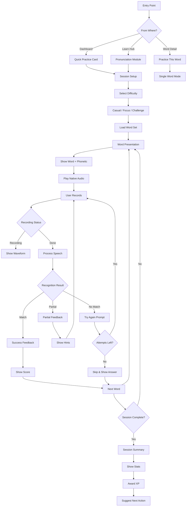

# Task 5: Pronunciation Practice UX

> **Last Updated:** 2025-12-14  
> **Owner:** Product Team  
> **Review Cycle:** Quarterly

---

## 1. UX Flow Diagram



---

## 2. Wireframes

### 2.1 Word Presentation Screen

```
┌─────────────────────────────────────┐
│  ← Pronunciation Practice    1/8   │
│                                     │
│  ━━━━━━━━━━━━━━━━━━━━━━━━━━━━━━━━━━ │
│  ████████░░░░░░░░░░░░░░░░░░░░░░░░░ │
│                                     │
├─────────────────────────────────────┤
│                                     │
│                                     │
│           здраво                    │
│        /ZDRAH-vo/                   │
│                                     │
│           hello                     │
│                                     │
│                                     │
│        ┌───────────────┐            │
│        │   🔊 Listen   │            │
│        └───────────────┘            │
│                                     │
├─────────────────────────────────────┤
│                                     │
│  💡 Common mistake:                 │
│  The "з" sounds like "z" in "zoo", │
│  not like "s"                       │
│                                     │
├─────────────────────────────────────┤
│                                     │
│        ┌───────────────────┐        │
│        │                   │        │
│        │   🎤 Hold to      │        │
│        │     Record        │        │
│        │                   │        │
│        └───────────────────┘        │
│                                     │
│    Attempts: ●●● (3 remaining)      │
│                                     │
│            [Skip →]                 │
└─────────────────────────────────────┘
```

### 2.2 Recording State

```
┌─────────────────────────────────────┐
│  ← Pronunciation Practice    1/8   │
│                                     │
│  ━━━━━━━━━━━━━━━━━━━━━━━━━━━━━━━━━━ │
│  ████████░░░░░░░░░░░░░░░░░░░░░░░░░ │
│                                     │
├─────────────────────────────────────┤
│                                     │
│           здраво                    │
│        /ZDRAH-vo/                   │
│                                     │
│           hello                     │
│                                     │
├─────────────────────────────────────┤
│                                     │
│     ╭─────────────────────────╮     │
│     │                         │     │
│     │  ▃▅▇▅▃▁▃▅▇█▇▅▃▁▃▅▇▅▃   │     │
│     │                         │     │
│     │     🔴 Recording...     │     │
│     │                         │     │
│     ╰─────────────────────────╯     │
│                                     │
│           Release to stop           │
│                                     │
├─────────────────────────────────────┤
│                                     │
│        ┌───────────────────┐        │
│        │                   │        │
│        │   🎤 Recording    │        │
│        │      ●●●          │        │
│        │                   │        │
│        └───────────────────┘        │
│                                     │
└─────────────────────────────────────┘
```

### 2.3 Success Feedback

```
┌─────────────────────────────────────┐
│  ← Pronunciation Practice    1/8   │
│                                     │
│  ━━━━━━━━━━━━━━━━━━━━━━━━━━━━━━━━━━ │
│  █████████████░░░░░░░░░░░░░░░░░░░░ │
│                                     │
├─────────────────────────────────────┤
│                                     │
│            ✓ Excellent!             │
│                                     │
│  ╭─────────────────────────────╮    │
│  │                             │    │
│  │         здраво              │    │
│  │       /ZDRAH-vo/            │    │
│  │                             │    │
│  │   ┌─────────────────────┐   │    │
│  │   │ Confidence: 94%     │   │    │
│  │   │ ████████████████░░░ │   │    │
│  │   └─────────────────────┘   │    │
│  │                             │    │
│  │        +10 XP               │    │
│  │                             │    │
│  ╰─────────────────────────────╯    │
│                                     │
│   🔊 Your recording                 │
│   ▶ ━━━━━━━━━━━━━━━━━━━━━ 0:02     │
│                                     │
│   🔊 Native speaker                 │
│   ▶ ━━━━━━━━━━━━━━━━━━━━━ 0:01     │
│                                     │
├─────────────────────────────────────┤
│                                     │
│  ┌─────────────────────────────┐    │
│  │       Continue →             │    │
│  └─────────────────────────────┘    │
│                                     │
└─────────────────────────────────────┘
```

### 2.4 Partial Match / Retry

```
┌─────────────────────────────────────┐
│  ← Pronunciation Practice    1/8   │
│                                     │
│  ━━━━━━━━━━━━━━━━━━━━━━━━━━━━━━━━━━ │
│  ████████░░░░░░░░░░░░░░░░░░░░░░░░░ │
│                                     │
├─────────────────────────────────────┤
│                                     │
│           Almost there!             │
│                                     │
│           здраво                    │
│        /ZDRAH-vo/                   │
│                                     │
│  ╭─────────────────────────────╮    │
│  │ We heard: "sdra-vo"         │    │
│  │                             │    │
│  │ 💡 Tip: Make the "з"        │    │
│  │ sound more like a buzzing   │    │
│  │ "z", not a soft "s"         │    │
│  ╰─────────────────────────────╯    │
│                                     │
│   🔊 Listen again                   │
│   ▶ ━━━━━━━━━━━━━━━━━━━━━ 0:01     │
│                                     │
│    Attempts: ●●○ (2 remaining)      │
│                                     │
├─────────────────────────────────────┤
│                                     │
│  ┌────────────┐  ┌────────────┐     │
│  │  Try Again │  │   Skip →   │     │
│  └────────────┘  └────────────┘     │
│                                     │
└─────────────────────────────────────┘
```

### 2.5 Session Summary

```
┌─────────────────────────────────────┐
│                                     │
│        🎉 Session Complete!         │
│                                     │
│  ╭─────────────────────────────╮    │
│  │                             │    │
│  │   ┌─────────────────────┐   │    │
│  │   │       8/8           │   │    │
│  │   │   words practiced   │   │    │
│  │   └─────────────────────┘   │    │
│  │                             │    │
│  │      +45 XP earned          │    │
│  │                             │    │
│  ╰─────────────────────────────╯    │
│                                     │
│  ━━━━━━━━━━━━━━━━━━━━━━━━━━━━━━━━━  │
│                                     │
│  SESSION STATS                      │
│  ┌────────┬────────┬────────┐       │
│  │ First  │ Avg    │ Words  │       │
│  │ Try    │ Score  │ Mastered│      │
│  │  75%   │  87%   │   6    │       │
│  └────────┴────────┴────────┘       │
│                                     │
│  WORDS TO KEEP PRACTICING           │
│  ┌─────────────────────────────┐    │
│  │ благодарам  →  thank you    │    │
│  │ изволете    →  here you go  │    │
│  └─────────────────────────────┘    │
│                                     │
│  ┌─────────────────────────────┐    │
│  │     Practice More →          │    │
│  └─────────────────────────────┘    │
│                                     │
│          [Back to Dashboard]        │
│                                     │
└─────────────────────────────────────┘
```

---

## 3. Rules & Logic

### 3.1 Attempt Rules

| Rule | Value | Description |
|------|-------|-------------|
| Max attempts per word | 3 | User can try 3 times before auto-skip |
| Confidence threshold (pass) | ≥70% | Considered "correct" |
| Confidence threshold (excellent) | ≥90% | Bonus XP awarded |
| Retry available | Yes | Can retry after partial match |
| Skip penalty | -5 XP | Deducted if user skips |

### 3.2 Scoring Rules

| Action | XP Reward |
|--------|-----------|
| First try success (≥90%) | +15 XP |
| First try success (≥70%) | +10 XP |
| Second try success | +7 XP |
| Third try success | +5 XP |
| Skip word | 0 XP |
| Complete session | +10 bonus XP |
| Perfect session (all first try) | +25 bonus XP |

### 3.3 Session Configuration

| Setting | Casual | Focus | Challenge |
|---------|--------|-------|-----------|
| Words per session | 5 | 8 | 12 |
| Time limit per word | None | 30s | 15s |
| XP multiplier | 1x | 1.25x | 1.5x |
| Hints available | Always | First 2 | None |
| Native audio plays | 3x | 2x | 1x |

---

## 4. Content: A1-A2 Word List (50 Words)

### 4.1 Greetings & Basics (10 words)

| Macedonian | Phonetic | English | Common Mistake |
|------------|----------|---------|----------------|
| здраво | ZDRAH-vo | hello | "з" sounds like "z", not "s" |
| добро утро | DOH-bro OO-tro | good morning | Stress on first syllable |
| добар ден | DOH-bar den | good day | "а" is short, not long |
| добра вечер | DOH-bra VEH-cher | good evening | Roll the "р" slightly |
| довидување | doh-vee-DOO-va-nye | goodbye | Don't skip the "у" |
| да | dah | yes | Short and crisp |
| не | neh | no | Short, not "nay" |
| молам | MOH-lam | please | "о" is round, not flat |
| благодарам | blah-goh-DAH-ram | thank you | Four syllables |
| извини | eez-VEE-nee | sorry | Stress on second syllable |

### 4.2 Numbers (10 words)

| Macedonian | Phonetic | English | Common Mistake |
|------------|----------|---------|----------------|
| еден | EH-den | one | Short "е" sounds |
| два | dvah | two | "д" is soft |
| три | tree | three | Roll the "р" |
| четири | CHEH-tee-ree | four | "ч" like "ch" in "church" |
| пет | pet | five | Short and crisp |
| шест | shest | six | "ш" like "sh" in "shop" |
| седум | SEH-doom | seven | Stress on first syllable |
| осум | OH-soom | eight | "о" is round |
| девет | DEH-vet | nine | Two syllables |
| десет | DEH-set | ten | Stress on first syllable |

### 4.3 Common Phrases (15 words)

| Macedonian | Phonetic | English | Common Mistake |
|------------|----------|---------|----------------|
| како сте | KAH-ko steh | how are you (formal) | "к" is unaspirated |
| добро сум | DOH-bro soom | I'm fine | "у" like "oo" |
| не разбирам | neh raz-BEE-ram | I don't understand | Stress on "би" |
| повторете | pov-toh-REH-teh | repeat please | Four syllables |
| колку чини | KOL-koo CHEE-nee | how much is it | "ч" like "ch" |
| каде е | KAH-deh eh | where is | Two words, short |
| што е тоа | shto eh toh-AH | what is that | "ш" like "sh" |
| јас сум | yahs soom | I am | "ј" like "y" in "yes" |
| ви благодарам | vee blah-goh-DAH-ram | thank you (formal) | Add "ви" clearly |
| нема проблем | NEH-ma proh-BLEM | no problem | Stress on "не" and "блем" |
| се разбира | seh raz-BEE-ra | of course | Three words flow together |
| извинете | eez-vee-NEH-teh | excuse me (formal) | Four syllables |
| добредојдовте | dob-reh-DOY-dov-teh | welcome (formal) | Five syllables |
| пријатно | pree-YAHT-no | nice/pleasant | "ј" like "y" |
| среќен пат | SREH-kyen paht | have a good trip | "ќ" is soft "k" |

### 4.4 Food & Drink (10 words)

| Macedonian | Phonetic | English | Common Mistake |
|------------|----------|---------|----------------|
| вода | VOH-da | water | Short "о" |
| кафе | KAH-feh | coffee | Stress on first syllable |
| леб | leb | bread | Short, one syllable |
| сирење | SEE-reh-nye | cheese | "њ" like "ny" in "canyon" |
| месо | MEH-so | meat | Two syllables |
| јаболко | YAH-bol-ko | apple | "ј" like "y" |
| грозје | GROZ-yeh | grapes | "ј" is subtle |
| солено | soh-LEH-no | salty | Stress on second syllable |
| сладко | SLAHT-ko | sweet | "д" is silent in some dialects |
| жеден | ZHEH-den | thirsty | "ж" like "zh" in "measure" |

### 4.5 Essential Verbs (5 words)

| Macedonian | Phonetic | English | Common Mistake |
|------------|----------|---------|----------------|
| сакам | SAH-kam | I want/love | Short "а" sounds |
| имам | EE-mam | I have | Stress on first syllable |
| одам | OH-dam | I go | Short word |
| јадам | YAH-dam | I eat | "ј" like "y" |
| пијам | PEE-yam | I drink | Two syllables |

---

## 5. Messaging & Microcopy

### 5.1 Onboarding Messages

| Screen | English | Macedonian | Transliteration |
|--------|---------|------------|-----------------|
| Welcome | Perfect your Macedonian pronunciation | Усоврши го твојот македонски изговор | Usovrshi go tvojot makedonski izgovor |
| Why it helps | Speaking builds muscle memory for better retention | Говорењето гради мускулна меморија за подобро паметење | Govorenjeto gradi muskulna memorija za podobro pametenje |
| How it works | Listen, then record yourself saying the word | Слушај, па снимај се себеси како го кажуваш зборот | Slushaj, pa snimaj se sebesi kako go kazuvash zborot |
| Tips | Speak clearly and at a natural pace | Зборувај јасно и со природно темпо | Zboruvaj jasno i so prirodno tempo |

### 5.2 Success Messages

| Confidence | English | Macedonian | Transliteration |
|------------|---------|------------|-----------------|
| 90-100% | Excellent! Native-like pronunciation! | Одлично! Изговор како мајчин јазик! | Odlichno! Izgovor kako majchin jazik! |
| 80-89% | Great job! Almost perfect! | Браво! Скоро совршено! | Bravo! Skoro sovrseno! |
| 70-79% | Good! Keep practicing! | Добро! Продолжи со вежбање! | Dobro! Prodolzhi so vezhbanje! |

### 5.3 Encouragement Messages

| Attempt | English | Macedonian | Transliteration |
|---------|---------|------------|-----------------|
| After 1st fail | Almost! Try emphasizing the first syllable | Скоро! Пробај да го нагласиш првиот слог | Skoro! Probaj da go naglasish prviot slog |
| After 2nd fail | You're getting closer! One more try | Се приближуваш! Уште еден обид | Se priblizuvash! Ushte eden obid |
| On skip | No worries! We'll practice this again later | Нема грижи! Ќе го вежбаме ова подоцна | Nema grizhi! Kje go vezhbame ova podocna |

### 5.4 Session Complete Messages

| State | English | Macedonian | Transliteration |
|-------|---------|------------|-----------------|
| Perfect | Incredible! You nailed every word! | Неверојатно! Го погоди секој збор! | Neverojatno! Go pogodi sekoj zbor! |
| Good | Great session! Your pronunciation is improving | Одлична сесија! Изговорот ти се подобрува | Odlichna sesija! Izgovorot ti se podobruva |
| Needs work | Good effort! Practice makes perfect | Добар труд! Со вежба се постигнува совршенство | Dobar trud! So vezhba se postignuva sovrsenstvo |

---

## 6. Technical Specifications

### 6.1 Speech Recognition Config

```typescript
interface SpeechRecognitionConfig {
  language: 'mk-MK' | 'mk';
  continuous: false;
  interimResults: true;
  maxAlternatives: 3;
  
  // Confidence thresholds
  thresholds: {
    excellent: 0.90;
    pass: 0.70;
    partial: 0.50;
  };
  
  // Audio settings
  audio: {
    sampleRate: 16000;
    channelCount: 1;
    echoCancellation: true;
    noiseSuppression: true;
  };
}
```

### 6.2 Word Data Schema

```typescript
interface PronunciationWord {
  id: string;
  macedonian: string;
  phonetic: string;
  english: string;
  audioUrl: string;
  category: 'greetings' | 'numbers' | 'phrases' | 'food' | 'verbs';
  difficulty: 'A1' | 'A2';
  commonMistake: {
    en: string;
    mk: string;
  };
  tips: string[];
  alternatives?: string[]; // Acceptable pronunciations
}
```

### 6.3 Session State

```typescript
interface PronunciationSession {
  id: string;
  userId: string;
  difficulty: 'casual' | 'focus' | 'challenge';
  words: PronunciationWord[];
  currentIndex: number;
  attempts: Record<string, number>;
  results: Array<{
    wordId: string;
    confidence: number;
    attempts: number;
    passed: boolean;
    xpEarned: number;
  }>;
  startedAt: Date;
  completedAt?: Date;
  totalXP: number;
}
```
