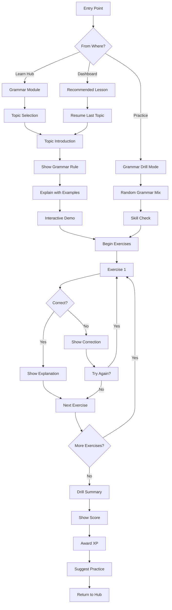

# Task 6: Grammar Drills UX

> **Last Updated:** 2025-12-14  
> **Owner:** Product Team  
> **Review Cycle:** Quarterly

---

## 1. UX Flow Diagram



---

## 2. Wireframes

### 2.1 Grammar Topic Introduction

```
┌─────────────────────────────────────┐
│  ← Grammar                    1/6   │
│                                     │
│  ━━━━━━━━━━━━━━━━━━━━━━━━━━━━━━━━━━ │
│  █░░░░░░░░░░░░░░░░░░░░░░░░░░░░░░░░ │
│                                     │
├─────────────────────────────────────┤
│                                     │
│          📖 Present Tense           │
│            Verbs                    │
│                                     │
│  ╭─────────────────────────────╮    │
│  │                             │    │
│  │ In Macedonian, verbs change │    │
│  │ based on who is doing the   │    │
│  │ action (the subject).       │    │
│  │                             │    │
│  │ This is called              │    │
│  │ "conjugation."              │    │
│  │                             │    │
│  ╰─────────────────────────────╯    │
│                                     │
│  GOAL                               │
│  Learn to conjugate common verbs    │
│  in the present tense.              │
│                                     │
│  TIME                               │
│  ~3 minutes • 6 exercises           │
│                                     │
├─────────────────────────────────────┤
│                                     │
│  ┌─────────────────────────────┐    │
│  │       Start Lesson →         │    │
│  └─────────────────────────────┘    │
│                                     │
└─────────────────────────────────────┘
```

### 2.2 Grammar Rule Explanation

```
┌─────────────────────────────────────┐
│  ← Present Tense              2/6   │
│                                     │
│  ━━━━━━━━━━━━━━━━━━━━━━━━━━━━━━━━━━ │
│  ████████░░░░░░░░░░░░░░░░░░░░░░░░░ │
│                                     │
├─────────────────────────────────────┤
│                                     │
│  THE RULE                           │
│  ╭─────────────────────────────╮    │
│  │                             │    │
│  │ For regular -а verbs,       │    │
│  │ remove -а and add:          │    │
│  │                             │    │
│  │   јас     →  -ам            │    │
│  │   ти      →  -аш            │    │
│  │   тој/таа →  -а             │    │
│  │   ние     →  -аме           │    │
│  │   вие     →  -ате           │    │
│  │   тие     →  -ат            │    │
│  │                             │    │
│  ╰─────────────────────────────╯    │
│                                     │
│  EXAMPLE: игра (to play)            │
│  ┌─────────────────────────────┐    │
│  │ јас игр|ам     I play       │    │
│  │ ти игр|аш      you play     │    │
│  │ тој игр|а      he plays     │    │
│  └─────────────────────────────┘    │
│                                     │
│        🔊 [Listen to examples]      │
│                                     │
├─────────────────────────────────────┤
│                                     │
│  ┌─────────────────────────────┐    │
│  │       Got it! Next →         │    │
│  └─────────────────────────────┘    │
│                                     │
└─────────────────────────────────────┘
```

### 2.3 Fill-in-the-Blank Exercise

```
┌─────────────────────────────────────┐
│  ← Present Tense              3/6   │
│                                     │
│  ━━━━━━━━━━━━━━━━━━━━━━━━━━━━━━━━━━ │
│  ████████████████░░░░░░░░░░░░░░░░░ │
│                                     │
├─────────────────────────────────────┤
│                                     │
│  EXERCISE 1 OF 6                    │
│                                     │
│  Fill in the correct verb form:     │
│                                     │
│  ╭─────────────────────────────╮    │
│  │                             │    │
│  │   Јас _______ кафе.        │    │
│  │   (пијам / пијаш / пие)     │    │
│  │                             │    │
│  │   I _______ coffee.         │    │
│  │                             │    │
│  ╰─────────────────────────────╯    │
│                                     │
│  ┌─────────────────────────────┐    │
│  │         пијам               │    │
│  └─────────────────────────────┘    │
│  ┌─────────────────────────────┐    │
│  │         пијаш               │    │
│  └─────────────────────────────┘    │
│  ┌─────────────────────────────┐    │
│  │         пие                 │    │
│  └─────────────────────────────┘    │
│                                     │
│  💡 Hint: "Јас" means "I"           │
│                                     │
├─────────────────────────────────────┤
│                                     │
│            [Skip →]                 │
│                                     │
└─────────────────────────────────────┘
```

### 2.4 Correct Answer Feedback

```
┌─────────────────────────────────────┐
│  ← Present Tense              3/6   │
│                                     │
│  ━━━━━━━━━━━━━━━━━━━━━━━━━━━━━━━━━━ │
│  ████████████████░░░░░░░░░░░░░░░░░ │
│                                     │
├─────────────────────────────────────┤
│                                     │
│          ✓ Correct!                 │
│                                     │
│  ╭─────────────────────────────╮    │
│  │                             │    │
│  │   Јас пијам кафе.          │    │
│  │   I drink coffee.           │    │
│  │                             │    │
│  ╰─────────────────────────────╯    │
│                                     │
│  WHY?                               │
│  ╭─────────────────────────────╮    │
│  │                             │    │
│  │ "Јас" (I) takes the -ам     │    │
│  │ ending. The root "пиј-"     │    │
│  │ plus "-ам" = "пијам"        │    │
│  │                             │    │
│  ╰─────────────────────────────╯    │
│                                     │
│          +10 XP                     │
│                                     │
├─────────────────────────────────────┤
│                                     │
│  ┌─────────────────────────────┐    │
│  │       Continue →             │    │
│  └─────────────────────────────┘    │
│                                     │
└─────────────────────────────────────┘
```

### 2.5 Incorrect Answer Feedback

```
┌─────────────────────────────────────┐
│  ← Present Tense              3/6   │
│                                     │
│  ━━━━━━━━━━━━━━━━━━━━━━━━━━━━━━━━━━ │
│  ████████████████░░░░░░░░░░░░░░░░░ │
│                                     │
├─────────────────────────────────────┤
│                                     │
│          ✗ Not quite                │
│                                     │
│  ╭─────────────────────────────╮    │
│  │                             │    │
│  │   You chose: пијаш          │    │
│  │   Correct: пијам            │    │
│  │                             │    │
│  ╰─────────────────────────────╯    │
│                                     │
│  EXPLANATION                        │
│  ╭─────────────────────────────╮    │
│  │                             │    │
│  │ "пијаш" is for "ти" (you),  │    │
│  │ but the sentence uses       │    │
│  │ "јас" (I), which needs      │    │
│  │ the "-ам" ending.           │    │
│  │                             │    │
│  ╰─────────────────────────────╯    │
│                                     │
│  Remember:                          │
│  јас → -ам   |   ти → -аш          │
│                                     │
├─────────────────────────────────────┤
│                                     │
│  ┌────────────┐  ┌────────────┐     │
│  │ Try Again  │  │ Continue → │     │
│  └────────────┘  └────────────┘     │
│                                     │
└─────────────────────────────────────┘
```

### 2.6 Drill Summary

```
┌─────────────────────────────────────┐
│                                     │
│        🎓 Lesson Complete!          │
│                                     │
│  ╭─────────────────────────────╮    │
│  │                             │    │
│  │   ┌─────────────────────┐   │    │
│  │   │       5/6           │   │    │
│  │   │     correct         │   │    │
│  │   └─────────────────────┘   │    │
│  │                             │    │
│  │      +40 XP earned          │    │
│  │                             │    │
│  ╰─────────────────────────────╯    │
│                                     │
│  TOPIC MASTERY                      │
│  ━━━━━━━━━━━━━━━━━━━━━━━━━━━━━━━━━  │
│  Present Tense Verbs                │
│  ████████████████████████░░░░░░░░  │
│  83% mastered                       │
│                                     │
│  WHAT YOU LEARNED                   │
│  ✓ Verb conjugation patterns        │
│  ✓ -ам, -аш, -а endings            │
│  ✓ Subject-verb agreement           │
│                                     │
│  PRACTICE MORE                      │
│  ┌─────────────────────────────┐    │
│  │ 📝 More present tense drills│    │
│  └─────────────────────────────┘    │
│                                     │
│  ┌─────────────────────────────┐    │
│  │    Next Topic: Past Tense    │    │
│  └─────────────────────────────┘    │
│                                     │
│          [Back to Grammar]          │
│                                     │
└─────────────────────────────────────┘
```

---

## 3. Rules & Logic

### 3.1 Lesson Structure

| Component | Duration | Purpose |
|-----------|----------|---------|
| Introduction | 30s | Hook and motivation |
| Rule explanation | 60-90s | Core grammar concept |
| Examples (3) | 45s | Pattern recognition |
| Exercises (6) | 3-5 min | Active practice |
| Summary | 30s | Reinforce and celebrate |

### 3.2 Exercise Types

| Type | Format | Difficulty |
|------|--------|------------|
| Multiple choice | Select correct option | Easy |
| Fill-in-blank | Type or select answer | Medium |
| Sentence builder | Arrange word tiles | Medium |
| Error correction | Fix the mistake | Hard |
| Translation | Translate full sentence | Hard |

### 3.3 Scoring Rules

| Action | XP Reward |
|--------|-----------|
| Correct on first try | +10 XP |
| Correct on retry | +5 XP |
| View hint then correct | +7 XP |
| Skip exercise | 0 XP |
| Complete lesson | +15 bonus XP |
| Perfect score (6/6) | +20 bonus XP |

### 3.4 Adaptive Difficulty

```typescript
interface AdaptiveDifficulty {
  // If accuracy < 60%, reduce difficulty
  lowAccuracyThreshold: 0.6;
  
  // If accuracy > 90%, increase difficulty
  highAccuracyThreshold: 0.9;
  
  // Adjustments
  adjustments: {
    moreHints: boolean;
    easierExercises: boolean;
    fewerOptions: boolean;
    longerTimeLimit: boolean;
  };
}
```

---

## 4. Content: 8 Grammar Mini-Lessons (A1-A2)

### Lesson 1: Personal Pronouns

**Goal:** Learn the Macedonian personal pronouns

**Rule:**
| Macedonian | English | Usage |
|------------|---------|-------|
| јас | I | First person singular |
| ти | you (informal) | Second person singular |
| тој | he | Third person masculine |
| таа | she | Third person feminine |
| тоа | it | Third person neuter |
| ние | we | First person plural |
| вие | you (formal/plural) | Second person formal |
| тие | they | Third person plural |

**Exercises:**
1. Match pronouns to meanings
2. Fill in: "_____ сум студент" (I am a student)
3. Choose: "_____ е мојата сестра" (She is my sister)
4. Translate: "We are friends" → "_____ сме пријатели"
5. Error fix: "Тој е мојата мајка" → Correct pronoun?
6. Complete dialogue with pronouns

---

### Lesson 2: Present Tense Verbs (-а verbs)

**Goal:** Conjugate regular -а verbs in present tense

**Rule:**
| Pronoun | Ending | Example (игра - to play) |
|---------|--------|--------------------------|
| јас | -ам | играм |
| ти | -аш | играш |
| тој/таа/тоа | -а | игра |
| ние | -аме | играме |
| вие | -ате | играте |
| тие | -ат | играат |

**Exercises:**
1. Conjugate "работа" (to work) for "јас"
2. Fill in: "Тие _______ футбал" (They play football)
3. Choose correct: "Ние _______ во библиотека" (work)
4. Match conjugations to pronouns
5. Translate: "She reads a book" → "Таа _____ книга"
6. Complete the conjugation table

---

### Lesson 3: Definite Article (The)

**Goal:** Use definite articles correctly

**Rule:**
| Gender | Singular | Plural |
|--------|----------|--------|
| Masculine | -от / -ов / -он | -ите |
| Feminine | -та | -те |
| Neuter | -то | -та |

**Examples:**
- книга → книгата (the book)
- човек → човекот (the man)
- дете → детето (the child)

**Exercises:**
1. Add article: "Каде е _____?" (книга)
2. Choose: "_____ е на масата" (книгата/книга)
3. Transform: "куќа" → "the house"
4. Match nouns with articles
5. Translate: "The children are playing"
6. Error correction: "Жената е тука" or "Жена е тука"?

---

### Lesson 4: Possession (My, Your, His...)

**Goal:** Express ownership in Macedonian

**Rule:**
| Pronoun | Possessive | Example |
|---------|------------|---------|
| јас | мој/моја/мое | мојот брат |
| ти | твој/твоја/твое | твојата книга |
| тој | негов/негова/негово | неговата куќа |
| таа | нејзин/нејзина/нејзино | нејзиниот син |
| ние | наш/наша/наше | нашето село |
| вие | ваш/ваша/ваше | вашата работа |
| тие | нивни/нивна/нивно | нивните деца |

**Exercises:**
1. Complete: "Ова е _____ компјутер" (my)
2. Choose gender: "_____ сестра" (my - feminine)
3. Translate: "her house"
4. Fill in dialogue about family members
5. Match possessives to nouns
6. Error fix: "Мојот мајка" → Correct form?

---

### Lesson 5: Basic Prepositions

**Goal:** Use common prepositions correctly

**Rule:**
| Preposition | Meaning | Example |
|-------------|---------|---------|
| во | in, into | во куќата (in the house) |
| на | on, at | на масата (on the table) |
| од | from | од Скопје (from Skopje) |
| за | for, about | за тебе (for you) |
| со | with | со мене (with me) |
| до | to, until | до школо (to school) |
| под | under | под масата (under the table) |
| над | above | над вратата (above the door) |

**Exercises:**
1. Choose: "Книгата е _____ масата" (on)
2. Fill in: "Јас живеам _____ Скопје" (in)
3. Translate: "I go to school" with preposition
4. Match prepositions to pictures
5. Complete sentences with correct prepositions
6. Error fix: "Одам на училиште" or "Одам во училиште"?

---

### Lesson 6: Question Words

**Goal:** Form basic questions in Macedonian

**Rule:**
| Question Word | Meaning | Example |
|---------------|---------|---------|
| Што? | What? | Што правиш? |
| Кој?/Која?/Кое? | Who?/Which? | Кој е тој? |
| Каде? | Where? | Каде живееш? |
| Кога? | When? | Кога доаѓаш? |
| Како? | How? | Како си? |
| Зошто? | Why? | Зошто плачеш? |
| Колку? | How much/many? | Колку чини? |

**Exercises:**
1. Match: "_____ е твоето име?" (What)
2. Fill in: "_____ живееш?" (Where)
3. Choose: "_____ доаѓаш?" (When)
4. Form a question from statement
5. Translate: "Why are you sad?"
6. Complete dialogue with question words

---

### Lesson 7: Negation

**Goal:** Make negative sentences correctly

**Rule:**
- Add "не" before the verb
- "Не" never changes form
- Double negatives are correct: "никогаш не" (never)

| Affirmative | Negative |
|-------------|----------|
| Сакам | Не сакам |
| Разбирам | Не разбирам |
| Знам | Не знам |

**Special negatives:**
| Word | Meaning |
|------|---------|
| никој | nobody |
| ништо | nothing |
| никаде | nowhere |
| никогаш | never |

**Exercises:**
1. Negate: "Јас сакам кафе" → "Јас _____ сакам кафе"
2. Choose: "_____ не знам" (nothing/никој/ништо)
3. Fill in: "Таа _____ разбира англиски"
4. Translate: "I never go there"
5. Match negatives to affirmatives
6. Error fix: "Не никој е тука"

---

### Lesson 8: Past Tense (л-form)

**Goal:** Form simple past tense statements

**Rule:**
| Pronoun | л-form Ending | Example (работа → работел) |
|---------|---------------|----------------------------|
| јас | -л (m) / -ла (f) | работел/работела сум |
| ти | -л (m) / -ла (f) | работел/работела си |
| тој | -л | работел (е) |
| таа | -ла | работела (е) |
| ние | -ле | работеле сме |
| вие | -ле | работеле сте |
| тие | -ле | работеле (се) |

**Note:** The auxiliary "сум/си/е" comes after the main verb.

**Exercises:**
1. Form past: "јас игра" → "јас _____ сум"
2. Choose: "Тој _____ книга" (read - past)
3. Fill in: "Ние _____ сме во Охрид" (be - past)
4. Translate: "She worked yesterday"
5. Match past forms to subjects
6. Convert present to past tense

---

## 5. Messaging & Microcopy

### 5.1 Onboarding Messages

| Screen | English | Macedonian | Transliteration |
|--------|---------|------------|-----------------|
| Welcome | Master Macedonian grammar step by step | Совладај ја македонската граматика чекор по чекор | Sovladaj ja makedonskata gramatika chekor po chekor |
| Why it helps | Understanding rules makes speaking easier | Разбирањето правила го олеснува зборувањето | Razbiranjeto pravila go olesnuva zboruvanjeto |
| How it works | Learn a rule, see examples, then practice | Научи правило, види примери, па вежбај | Nauchi pravilo, vidi primeri, pa vezhbaj |

### 5.2 Exercise Feedback

| Type | English | Macedonian | Transliteration |
|------|---------|------------|-----------------|
| Correct | That's right! | Точно! | Tochno! |
| Excellent | Perfect grammar! | Совршена граматика! | Sovrsena gramatika! |
| Incorrect | Not quite right | Не е сосема точно | Ne e sosema tochno |
| Try again | Give it another try | Пробај уште еднаш | Probaj ushte ednash |
| Hint | Need a hint? | Ти треба помош? | Ti treba pomosh? |

### 5.3 Encouragement

| Context | English | Macedonian | Transliteration |
|---------|---------|------------|-----------------|
| After mistake | Mistakes help you learn! | Грешките помагаат да научиш! | Greshkite pomagaat da nauchish! |
| Halfway | You're doing great! Keep going | Одлично! Продолжи така | Odlichno! Prodolzhi taka |
| Almost done | Just one more exercise! | Уште само една вежба! | Ushte samo edna vezhba! |
| Struggling | Take your time, no rush | Земи си време, нема брзање | Zemi si vreme, nema brzanje |

### 5.4 Completion Messages

| Score | English | Macedonian | Transliteration |
|-------|---------|------------|-----------------|
| 100% | Grammar genius! Perfect score! | Граматичар! Совршен резултат! | Gramatichar! Sovrsen rezultat! |
| 80-99% | Excellent work! Almost perfect | Одлична работа! Скоро совршено | Odlichna rabota! Skoro sovrseno |
| 60-79% | Good progress! Keep practicing | Добар напредок! Продолжи со вежби | Dobar napredok! Prodolzhi so vezhbi |
| <60% | Keep at it! Practice makes perfect | Не се откажувај! Со вежба се учи | Ne se otkavaj! So vezhba se uchi |

---

## 6. Technical Specifications

### 6.1 Lesson Data Schema

```typescript
interface GrammarLesson {
  id: string;
  title: {
    en: string;
    mk: string;
  };
  slug: string;
  level: 'A1' | 'A2' | 'B1' | 'B2';
  order: number;
  estimatedMinutes: number;
  
  introduction: {
    goal: { en: string; mk: string };
    hook: { en: string; mk: string };
  };
  
  rule: {
    explanation: { en: string; mk: string };
    table?: GrammarTable;
    examples: GrammarExample[];
  };
  
  exercises: GrammarExercise[];
  
  summary: {
    keyPoints: Array<{ en: string; mk: string }>;
    practiceLink?: string;
  };
}

interface GrammarTable {
  headers: string[];
  rows: string[][];
}

interface GrammarExample {
  macedonian: string;
  english: string;
  highlight?: string; // Word to highlight
  audioUrl?: string;
}

interface GrammarExercise {
  id: string;
  type: 'multiple-choice' | 'fill-blank' | 'sentence-builder' | 'error-correction' | 'translation';
  prompt: { en: string; mk: string };
  options?: string[];
  correctAnswer: string | string[];
  explanation: { en: string; mk: string };
  hint?: { en: string; mk: string };
  difficulty: 1 | 2 | 3;
}
```

### 6.2 Session State

```typescript
interface GrammarSession {
  lessonId: string;
  userId: string;
  currentStep: 'intro' | 'rule' | 'examples' | 'exercises' | 'summary';
  exerciseIndex: number;
  answers: Array<{
    exerciseId: string;
    userAnswer: string;
    correct: boolean;
    attempts: number;
    usedHint: boolean;
  }>;
  startedAt: Date;
  completedAt?: Date;
  score: number;
  xpEarned: number;
}
```

### 6.3 Progress Tracking

```typescript
interface GrammarProgress {
  userId: string;
  topicId: string;
  
  // Mastery score (0-100)
  mastery: number;
  
  // Exercise history
  totalAttempts: number;
  correctAnswers: number;
  accuracy: number;
  
  // Spaced repetition
  lastPracticed: Date;
  nextReviewDate: Date;
  reviewInterval: number; // days
  
  // Weak areas
  weakPoints: string[];
}
```
