# Implementation Plan

**Last Updated:** 2025-01-14  
**Owner:** Engineering Lead  
**Review Cycle:** Per sprint

---

## Table of Contents

1. [Executive Summary](#1-executive-summary)
2. [Priority Matrix](#2-priority-matrix)
3. [Sprint Breakdown](#3-sprint-breakdown)
4. [Detailed Tickets](#4-detailed-tickets)
5. [Dependencies](#5-dependencies)
6. [Feature Flags](#6-feature-flags)
7. [KPIs & Success Metrics](#7-kpis--success-metrics)
8. [Rollout Plan](#8-rollout-plan)
9. [Risk Assessment](#9-risk-assessment)

---

## 1. Executive Summary

This implementation plan covers the 9 UX audit areas identified for MK Language Lab. Work is organized into 3 sprints over 6 weeks, prioritizing:

1. **Critical accessibility & reliability fixes** (Sprint 1)
2. **Core UX improvements & new features** (Sprint 2)
3. **Polish, localization & performance** (Sprint 3)

**Total Estimated Effort:** 180-220 engineering hours  
**Timeline:** 6 weeks (3 × 2-week sprints)  
**Team Size:** 2-3 frontend developers, 1 designer (part-time)

---

## 2. Priority Matrix

### P0 - Critical (Week 1-2)
Must fix immediately. Blocking user experience or accessibility compliance.

| Issue | Impact | Effort |
|-------|--------|--------|
| Button misalignment & touch targets | High | Low |
| Image proxy reliability (time.mk) | High | Medium |
| Toast z-index behind modals | Medium | Low |
| WCAG contrast violations | High | Low |
| Focus ring inconsistencies | Medium | Low |

### P1 - High (Week 2-4)
Important for core experience. Should complete in current release.

| Issue | Impact | Effort |
|-------|--------|--------|
| Design tokens standardization | High | Medium |
| Dashboard engagement flow | High | High |
| Pronunciation practice UX | High | High |
| Grammar drills MVP | High | High |
| Microcopy updates (EN/MK) | Medium | Medium |

### P2 - Medium (Week 4-6)
Quality improvements. Can defer if needed.

| Issue | Impact | Effort |
|-------|--------|--------|
| Pull-to-refresh enhancement | Medium | Low |
| Achievement animations | Low | Medium |
| Lighthouse optimization | Medium | Medium |
| Advanced image caching | Medium | High |
| Visual regression tests | Medium | Medium |

### P3 - Low (Backlog)
Nice to have. Schedule opportunistically.

| Issue | Impact | Effort |
|-------|--------|--------|
| Keyboard shortcuts | Low | Low |
| Custom themes | Low | High |
| Social sharing | Low | Medium |
| Offline lesson download | Medium | High |

---

## 3. Sprint Breakdown

### Sprint 1: Foundation & Fixes (Days 1-10)

**Goal:** Eliminate accessibility blockers, fix image reliability, standardize design tokens

| Day | Focus | Key Deliverables |
|-----|-------|------------------|
| 1-2 | Setup & Audit | Token audit complete, test matrix defined |
| 3-4 | Button/Touch Fixes | All buttons 44px min, consistent radii |
| 5-6 | Image Proxy v2 | Multi-strategy fetch, increased timeout |
| 7-8 | Accessibility | Contrast fixes, focus rings, skip links |
| 9-10 | QA & Polish | Sprint review, bug fixes |

**Definition of Done:**
- [ ] Zero WCAG AA violations in Lighthouse
- [ ] Image success rate > 90% (time.mk included)
- [ ] All buttons pass touch target audit
- [ ] Design tokens applied to all components

### Sprint 2: Features (Days 11-20)

**Goal:** Ship dashboard improvements, pronunciation practice, grammar drills MVP

| Day | Focus | Key Deliverables |
|-----|-------|------------------|
| 11-12 | Dashboard Flow | Goal card, progress bar, recommendations |
| 13-14 | Dashboard Polish | Streak display, XP animation |
| 15-16 | Pronunciation v1 | Record flow, playback comparison |
| 17-18 | Grammar Drills v1 | 4 lessons, fill-in-blank, scoring |
| 19-20 | Integration & QA | E2E tests, bug fixes |

**Definition of Done:**
- [ ] Dashboard shows daily goal with progress
- [ ] Users can record and hear pronunciation
- [ ] 4 grammar lessons playable start-to-finish
- [ ] All features work in EN and MK locales

### Sprint 3: Polish & Launch (Days 21-30)

**Goal:** Complete localization, performance optimization, launch prep

| Day | Focus | Key Deliverables |
|-----|-------|------------------|
| 21-22 | Microcopy | All strings translated, tone consistent |
| 23-24 | Performance | Bundle optimization, image lazy loading |
| 25-26 | More Grammar | Remaining 4 lessons |
| 27-28 | Final QA | Full device matrix testing |
| 29-30 | Launch Prep | Feature flags, rollout plan, monitoring |

**Definition of Done:**
- [ ] All microcopy in both languages, reviewed
- [ ] Lighthouse performance ≥ 85
- [ ] 8 grammar lessons complete
- [ ] QA checklists signed off
- [ ] Rollout plan approved

---

## 4. Detailed Tickets

### Epic 1: UI Alignment & Accessibility

#### MKLAB-101: Standardize Button Touch Targets
**Priority:** P0  
**Estimate:** 4 hours  
**Assignee:** Frontend Dev 1

**Description:**
Ensure all interactive elements meet WCAG 2.5.5 (44x44px minimum touch target).

**Acceptance Criteria:**
- [ ] Button component height minimum 44px (already defined, verify usage)
- [ ] Icon buttons have adequate padding
- [ ] Link targets within text have sufficient spacing
- [ ] Tab bar icons meet touch target size

**Technical Notes:**
```css
/* Verify in button.tsx */
height: 'h-11', /* 44px - sm size */
height: 'h-12', /* 48px - default */
height: 'h-14', /* 56px - lg */
```

---

#### MKLAB-102: Fix Border Radius Inconsistencies
**Priority:** P0  
**Estimate:** 2 hours  
**Assignee:** Frontend Dev 1

**Description:**
Audit all components using border-radius and ensure they use the `--radius` token.

**Acceptance Criteria:**
- [ ] All cards use `rounded-lg` (0.5rem)
- [ ] All buttons use `rounded-md` (0.375rem)
- [ ] No hardcoded radius values in components
- [ ] Input fields consistent with buttons

---

#### MKLAB-103: Resolve Toast Z-Index Layering
**Priority:** P0  
**Estimate:** 1 hour  
**Assignee:** Frontend Dev 1

**Description:**
Toast notifications appear behind modals. Fix z-index stacking.

**Acceptance Criteria:**
- [ ] Toasts appear above all other content
- [ ] Toasts visible when modal is open
- [ ] Z-index values documented in design tokens

**Technical Notes:**
```css
/* theme.css additions */
--z-modal: 50;
--z-toast: 60;
--z-tooltip: 70;
```

---

#### MKLAB-104: WCAG Contrast Compliance
**Priority:** P0  
**Estimate:** 3 hours  
**Assignee:** Frontend Dev 2

**Description:**
Fix all contrast violations identified in the audit.

**Acceptance Criteria:**
- [ ] Yellow text (#f6d83b) never on white background
- [ ] Muted text color adjusted to meet 4.5:1 ratio
- [ ] Placeholder text meets 3:1 minimum
- [ ] All color pairs documented

---

#### MKLAB-105: Focus Ring Standardization
**Priority:** P0  
**Estimate:** 2 hours  
**Assignee:** Frontend Dev 2

**Description:**
Ensure consistent, visible focus indicators across all interactive elements.

**Acceptance Criteria:**
- [ ] Focus ring uses `ring-2 ring-accent ring-offset-2`
- [ ] Focus visible on keyboard navigation (`:focus-visible`)
- [ ] No focus ring on mouse click
- [ ] Custom focus styles for inputs match buttons

---

### Epic 2: Image Reliability

#### MKLAB-201: Image Proxy Multi-Strategy Fetch
**Priority:** P0  
**Estimate:** 6 hours  
**Assignee:** Frontend Dev 2

**Description:**
Implement multiple fetch strategies in the image proxy to improve reliability.

**Acceptance Criteria:**
- [ ] Try origin referer first
- [ ] Fallback to no-referer
- [ ] Try Googlebot user-agent
- [ ] Increase timeout to 12s
- [ ] Return structured error on final failure

**Technical Notes:**
See `02-news-image-reliability.md` for implementation spec.

---

#### MKLAB-202: Image Caching Layer
**Priority:** P2  
**Estimate:** 8 hours  
**Assignee:** Backend Dev

**Description:**
Add Vercel KV caching to reduce repeated proxy requests.

**Acceptance Criteria:**
- [ ] Successful images cached for 1 hour
- [ ] Failed URLs marked with short TTL (5 min)
- [ ] Cache invalidation on demand
- [ ] Metrics for cache hit/miss rate

---

### Epic 3: Design System

#### MKLAB-301: Design Tokens Migration
**Priority:** P1  
**Estimate:** 8 hours  
**Assignee:** Frontend Dev 1

**Description:**
Consolidate design-tokens.json and theme.css into single source of truth.

**Acceptance Criteria:**
- [ ] All spacing uses 8px base scale
- [ ] All colors defined as CSS variables
- [ ] Dark/light themes use same token names
- [ ] TypeScript types generated for tokens

---

#### MKLAB-302: Component Audit & Update
**Priority:** P1  
**Estimate:** 6 hours  
**Assignee:** Frontend Dev 1

**Description:**
Update all shadcn/ui components to use design tokens.

**Acceptance Criteria:**
- [ ] Button, Card, Input use tokens
- [ ] No inline color values
- [ ] Storybook-like documentation in code

---

### Epic 4: Dashboard Engagement

#### MKLAB-401: Daily Goal Card
**Priority:** P1  
**Estimate:** 6 hours  
**Assignee:** Frontend Dev 2

**Description:**
Implement the daily goal card with progress bar and celebration state.

**Acceptance Criteria:**
- [ ] Shows XP target and current progress
- [ ] Animated progress bar fill
- [ ] Celebration state when goal reached
- [ ] Persists goal preference per user

---

#### MKLAB-402: Streak Display
**Priority:** P1  
**Estimate:** 4 hours  
**Assignee:** Frontend Dev 2

**Description:**
Show current streak with visual flame animation.

**Acceptance Criteria:**
- [ ] Displays streak count prominently
- [ ] Flame animation for active streak
- [ ] Streak freeze indicator
- [ ] Motivational messaging for maintaining streak

---

#### MKLAB-403: Personalized Recommendations
**Priority:** P1  
**Estimate:** 8 hours  
**Assignee:** Frontend Dev 1

**Description:**
Implement recommendation engine for next lessons.

**Acceptance Criteria:**
- [ ] Suggests weak words for review
- [ ] Recommends next lesson in sequence
- [ ] Shows time-sensitive opportunities (streak at risk)
- [ ] 3-card carousel on dashboard

---

### Epic 5: Pronunciation Practice

#### MKLAB-501: Recording Flow
**Priority:** P1  
**Estimate:** 12 hours  
**Assignee:** Frontend Dev 2

**Description:**
Implement audio recording for pronunciation practice.

**Acceptance Criteria:**
- [ ] Microphone permission handling
- [ ] Visual recording indicator
- [ ] 3-second max recording length
- [ ] Playback of user recording
- [ ] Side-by-side with reference audio

**Technical Notes:**
See `05-pronunciation-practice-ux.md` for full spec.

---

#### MKLAB-502: Pronunciation Scoring
**Priority:** P1  
**Estimate:** 8 hours  
**Assignee:** Backend Dev

**Description:**
Implement basic pronunciation similarity scoring.

**Acceptance Criteria:**
- [ ] Compare user audio to reference
- [ ] Return similarity percentage
- [ ] Identify specific phonemes to improve
- [ ] Works offline (client-side fallback)

---

### Epic 6: Grammar Drills

#### MKLAB-601: Grammar Engine Core
**Priority:** P1  
**Estimate:** 10 hours  
**Assignee:** Frontend Dev 1

**Description:**
Build the exercise engine for grammar drills.

**Acceptance Criteria:**
- [ ] Fill-in-blank exercises
- [ ] Multiple choice exercises
- [ ] Sentence building exercises
- [ ] Conjugation tables
- [ ] Scoring and XP awards

---

#### MKLAB-602: Grammar Content - Batch 1
**Priority:** P1  
**Estimate:** 8 hours  
**Assignee:** Content Writer + Frontend

**Description:**
Implement first 4 grammar lessons.

**Lessons:**
1. Personal Pronouns
2. Present Tense
3. Definite Articles
4. Expressing Possession

**Acceptance Criteria:**
- [ ] Each lesson has 8-12 exercises
- [ ] All content in EN and MK
- [ ] Explanations with examples
- [ ] Tests pass with 100% coverage

---

#### MKLAB-603: Grammar Content - Batch 2
**Priority:** P2  
**Estimate:** 8 hours  
**Assignee:** Content Writer + Frontend

**Description:**
Implement remaining 4 grammar lessons.

**Lessons:**
5. Prepositions
6. Question Words
7. Negation
8. Past Tense

---

### Epic 7: Localization

#### MKLAB-701: Microcopy Audit & Update
**Priority:** P1  
**Estimate:** 6 hours  
**Assignee:** Content Writer

**Description:**
Review and update all UI strings per microcopy guidelines.

**Acceptance Criteria:**
- [ ] All strings in `07-ui-microcopy.json` implemented
- [ ] Tone: calm, encouraging, no guilt
- [ ] Tested by native Macedonian speaker
- [ ] Transliterations added where helpful

---

#### MKLAB-702: Translation File Sync
**Priority:** P1  
**Estimate:** 4 hours  
**Assignee:** Frontend Dev 1

**Description:**
Ensure en.json and mk.json are in sync with no missing keys.

**Acceptance Criteria:**
- [ ] Automated script to detect missing keys
- [ ] CI check for translation completeness
- [ ] All new features have both translations

---

### Epic 8: Quality & Performance

#### MKLAB-801: Lighthouse Optimization
**Priority:** P2  
**Estimate:** 8 hours  
**Assignee:** Frontend Dev 2

**Description:**
Achieve Lighthouse score ≥ 90 across all categories.

**Acceptance Criteria:**
- [ ] Performance ≥ 90
- [ ] Accessibility ≥ 95
- [ ] Best Practices ≥ 90
- [ ] SEO ≥ 95

---

#### MKLAB-802: Visual Regression Tests
**Priority:** P2  
**Estimate:** 6 hours  
**Assignee:** QA Engineer

**Description:**
Set up visual regression testing with Playwright.

**Acceptance Criteria:**
- [ ] Screenshots for key pages at 3 breakpoints
- [ ] CI integration for PR checks
- [ ] Baseline images stored in repo
- [ ] Diff threshold: 0.1%

---

#### MKLAB-803: E2E Test Coverage
**Priority:** P1  
**Estimate:** 8 hours  
**Assignee:** QA Engineer

**Description:**
Expand E2E tests to cover new features.

**Acceptance Criteria:**
- [ ] Dashboard goal flow tested
- [ ] Pronunciation recording tested
- [ ] Grammar drill completion tested
- [ ] Both locales tested
- [ ] Coverage report generated

---

## 5. Dependencies

```mermaid
graph TD
    A[MKLAB-301: Design Tokens] --> B[MKLAB-302: Component Audit]
    A --> C[MKLAB-101: Button Touch Targets]
    A --> D[MKLAB-104: Contrast Compliance]
    
    E[MKLAB-201: Image Proxy] --> F[MKLAB-202: Image Caching]
    
    G[MKLAB-401: Goal Card] --> H[MKLAB-402: Streak Display]
    G --> I[MKLAB-403: Recommendations]
    
    J[MKLAB-601: Grammar Engine] --> K[MKLAB-602: Content Batch 1]
    J --> L[MKLAB-603: Content Batch 2]
    
    M[MKLAB-501: Recording Flow] --> N[MKLAB-502: Scoring]
    
    O[MKLAB-701: Microcopy] --> P[MKLAB-702: Translation Sync]
    
    Q[All Features] --> R[MKLAB-803: E2E Tests]
    Q --> S[MKLAB-802: Visual Regression]
```



### Critical Path
1. Design Tokens (MKLAB-301) → unblocks all UI work
2. Image Proxy (MKLAB-201) → unblocks news reliability
3. Grammar Engine (MKLAB-601) → unblocks content work

### Parallel Tracks
- **Track A:** UI/Accessibility (Frontend Dev 1)
- **Track B:** Features (Frontend Dev 2)
- **Track C:** Infrastructure (Backend Dev)
- **Track D:** Content (Content Writer)

---

## 6. Feature Flags

Use feature flags for gradual rollout and quick rollback.

```typescript
// lib/feature-flags.ts
export const FEATURE_FLAGS = {
  // Sprint 1
  IMAGE_PROXY_V2: 'image_proxy_v2',           // Multi-strategy fetch
  DESIGN_TOKENS_V2: 'design_tokens_v2',       // New token system
  
  // Sprint 2
  DAILY_GOAL_CARD: 'daily_goal_card',         // Dashboard goal display
  PRONUNCIATION_PRACTICE: 'pronunciation',     // Recording feature
  GRAMMAR_DRILLS: 'grammar_drills',           // Grammar lessons
  
  // Sprint 3
  ADVANCED_RECOMMENDATIONS: 'recommendations', // Personalized suggestions
  IMAGE_CACHING: 'image_caching',             // KV cache layer
} as const;

// Usage
if (isFeatureEnabled(FEATURE_FLAGS.GRAMMAR_DRILLS)) {
  // Render grammar drills
}
```

### Rollout Schedule

| Feature | Beta (5%) | Canary (25%) | GA (100%) |
|---------|-----------|--------------|-----------|
| Image Proxy v2 | Week 2 | Week 2 | Week 3 |
| Design Tokens v2 | Week 2 | Week 3 | Week 4 |
| Daily Goal Card | Week 3 | Week 4 | Week 5 |
| Pronunciation | Week 4 | Week 5 | Week 6 |
| Grammar Drills | Week 4 | Week 5 | Week 6 |

---

## 7. KPIs & Success Metrics

### Primary Metrics

| Metric | Baseline | Target | Measurement |
|--------|----------|--------|-------------|
| Daily Active Users | - | +20% | Vercel Analytics |
| Session Duration | - | +15% | Analytics events |
| Lessons Completed/Day | - | +30% | Database queries |
| Streak Retention (7-day) | - | 40% | Cohort analysis |
| News Image Load Rate | ~60% | >90% | Sentry/logs |

### Technical Metrics

| Metric | Baseline | Target | Measurement |
|--------|----------|--------|-------------|
| Lighthouse Performance | - | ≥85 | CI/PageSpeed |
| Lighthouse Accessibility | - | ≥95 | CI/PageSpeed |
| Error Rate | - | <1% | Sentry |
| P95 Latency (API) | - | <500ms | Vercel logs |
| Core Web Vitals (LCP) | - | <2.5s | Vercel Analytics |

### User Experience Metrics

| Metric | Baseline | Target | Measurement |
|--------|----------|--------|-------------|
| Task Completion (Practice) | - | >80% | Analytics events |
| Error State Encounters | - | <5% sessions | Sentry |
| Locale Switch Usage | - | Track | Analytics |
| Goal Achievement Rate | - | >60% | Database |

### Tracking Implementation

```typescript
// lib/analytics.ts
export const trackEvent = (event: string, properties: Record<string, any>) => {
  // Vercel Analytics
  va?.track(event, properties);
  
  // Sentry breadcrumb
  Sentry.addBreadcrumb({
    category: 'user-action',
    message: event,
    data: properties,
  });
};

// Usage
trackEvent('lesson_completed', {
  lessonId: 'grammar-01',
  score: 85,
  duration: 180,
  locale: 'mk',
});
```

---

## 8. Rollout Plan

### Phase 1: Internal Testing (Week 5, Days 25-26)

- **Participants:** Team members, stakeholders
- **Focus:** Full feature testing, bug identification
- **Checklist:**
  - [ ] All P0 bugs fixed
  - [ ] All features behind flags
  - [ ] Monitoring dashboards ready
  - [ ] Rollback procedure documented

### Phase 2: Beta Release (Week 5, Days 27-28)

- **Audience:** 5% of traffic (via feature flags)
- **Duration:** 48 hours minimum
- **Success Criteria:**
  - Error rate < 2%
  - No P0 bugs reported
  - Positive qualitative feedback

### Phase 3: Canary Release (Week 6, Days 29)

- **Audience:** 25% of traffic
- **Duration:** 24 hours minimum
- **Monitoring:**
  - Watch error rates in Sentry
  - Monitor Core Web Vitals
  - Check analytics for anomalies

### Phase 4: General Availability (Week 6, Day 30)

- **Audience:** 100% of traffic
- **Actions:**
  - Remove feature flags
  - Update documentation
  - Announce release
  - Monitor for 48 hours post-launch

### Rollback Procedure

```bash
# 1. Disable feature flag (immediate)
# In Vercel dashboard or environment variable

# 2. If code rollback needed
git revert HEAD
git push origin main
# Vercel auto-deploys

# 3. If database migration issue
npx prisma migrate deploy --preview-feature
# Or restore from backup
```

---

## 9. Risk Assessment

### High Risk

| Risk | Likelihood | Impact | Mitigation |
|------|------------|--------|------------|
| Image proxy still fails | Medium | High | Multiple fallback strategies, caching |
| Pronunciation feature browser compat | Medium | High | Feature detection, fallback to listen-only |
| Scope creep delays launch | High | Medium | Strict sprint scope, defer P3 items |

### Medium Risk

| Risk | Likelihood | Impact | Mitigation |
|------|------------|--------|------------|
| Translation quality issues | Medium | Medium | Native speaker review, beta feedback |
| Performance regression | Low | High | Lighthouse CI, bundle size alerts |
| Grammar content gaps | Medium | Medium | Prioritize core lessons, iterate |

### Low Risk

| Risk | Likelihood | Impact | Mitigation |
|------|------------|--------|------------|
| Design token migration breaks UI | Low | Medium | Gradual migration, visual regression tests |
| Accessibility regressions | Low | High | axe-core CI, manual testing |

### Contingency Plans

1. **If image proxy can't be fixed:** Ship with aggressive fallback to placeholder, add manual image URL override in CMS
2. **If pronunciation feature delayed:** Launch grammar drills first, pronunciation in follow-up release
3. **If translation not ready:** Launch EN-only initially, MK as fast-follow

---

## Appendix: Quick Reference

### Sprint Velocity Assumptions
- 1 dev day = 6 productive hours
- Story points: 1 SP = 4 hours
- Sprint capacity: ~20 SP per dev per sprint

### Team Contacts
- Engineering Lead: TBD
- Designer: TBD
- QA: TBD
- Product: TBD

### Key Links
- Figma Designs: [link]
- Sentry Dashboard: [link]
- Vercel Project: [link]
- GitHub Repo: battaglia-v/mk-language-lab

---

**Approval:**

| Role | Name | Date | Signature |
|------|------|------|-----------|
| Engineering Lead | _____________ | ___/___/_____ | _________ |
| Product Manager | _____________ | ___/___/_____ | _________ |
| Design Lead | _____________ | ___/___/_____ | _________ |
